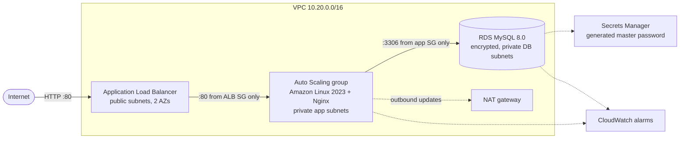

# aws-cloudformation-vpc-3tier

A production-style 3-tier web platform on AWS, defined in a single CloudFormation template.


## Why this exists

Most of my day-to-day work is running AWS infrastructure for a compliance platform. This repo rebuilds the core pattern from scratch: isolated network tiers, a load-balanced and self-healing app tier, and an encrypted database nobody can reach from the internet. It's written as code, so the whole thing can be created, reviewed and torn down with one command.

## Architecture



| Layer | Subnets | Route to internet |
|---|---|---|
| Public (ALB, NAT) | 10.20.0.0/24, 10.20.1.0/24 | Internet gateway |
| App (EC2) | 10.20.2.0/24, 10.20.3.0/24 | NAT gateway (outbound only) |
| Data (RDS) | 10.20.4.0/24, 10.20.5.0/24 | None |

## Design decisions

- **Security groups are chained, not opened by CIDR.** The app tier only accepts traffic from the ALB's security group, and the database only from the app tier's. Nothing in the app or DB tiers has a public IP.
- **No SSH, no key pairs.** Instances get an IAM role with `AmazonSSMManagedInstanceCore`, so access goes through Session Manager and is logged in CloudTrail. Port 22 is never opened.
- **IMDSv2 required** on every instance (`HttpTokens: required`), which blocks the SSRF-style metadata theft that IMDSv1 allowed.
- **No database password in the template.** `ManageMasterUserPassword: true` has RDS generate the password and store it in Secrets Manager.
- **Encryption everywhere:** EBS volumes and RDS storage are encrypted at rest.
- **Self-healing app tier.** The ASG uses ELB health checks against `/health`, so an instance that stops serving is replaced automatically. Target-tracking scaling holds average CPU near 60%.
- **Safe database changes.** `DeletionPolicy: Snapshot` takes a final snapshot if the stack or the DB is deleted. In `prod`, deletion protection and 7-day backups switch on through a condition.
- **Cost-aware defaults for a lab:** one NAT gateway (production would use one per AZ), t3.micro instances, and single-AZ RDS unless `DBMultiAZ=true`.

## Deploy

Prerequisites: AWS CLI v2 configured with an account where you can create VPC, EC2, ELB, RDS and IAM resources.

```bash
aws cloudformation deploy \
  --template-file template.yaml \
  --stack-name three-tier-dev \
  --parameter-overrides EnvironmentName=dev \
  --capabilities CAPABILITY_IAM \
  --region ap-south-1

aws cloudformation describe-stacks --stack-name three-tier-dev \
  --query "Stacks[0].Outputs" --output table --region ap-south-1
```

Open `WebsiteURL` from the outputs. Refresh a few times and the instance ID and AZ change, showing the ALB spreading traffic across both instances.

The stack takes about 10–15 minutes, mostly for RDS.

## Things to try

- **Kill an instance:** terminate one web instance in the EC2 console and watch the ASG replace it, then watch the target group mark it healthy again.
- **Reach an instance without SSH:** `aws ssm start-session --target <instance-id>`
- **Read the DB password safely:** `aws secretsmanager get-secret-value --secret-id <DBSecretArn>`
- **Trigger scaling:** run `stress` on an instance (via Session Manager) and watch the target-tracking policy add capacity.

## Cost and teardown

Running this costs money, mainly the NAT gateway and RDS instance (roughly USD 1.5–2 a day in ap-south-1 at the defaults). **Delete it when you're done:**

```bash
aws cloudformation delete-stack --stack-name three-tier-dev --region ap-south-1
```

A final RDS snapshot is kept because of the `Snapshot` deletion policy. Delete it from the RDS console if you don't need it.

## CI

`.github/workflows/validate.yml` runs [cfn-lint](https://github.com/aws-cloudformation/cfn-lint) on every push and pull request, so template mistakes are caught before anything is deployed.

## What I'd add next

- HTTPS listener with an ACM certificate and HTTP→HTTPS redirect
- One NAT gateway per AZ for production resilience
- WAF on the ALB
- Split into nested stacks (network / app / data) for independent lifecycle management
