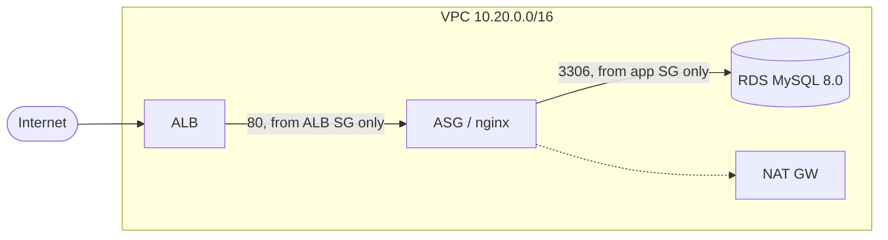

# aws-cloudformation-vpc-3tier

The standard 3-tier setup I end up building over and over at work, as a single CloudFormation template:

- VPC across 2 AZs with public / app / DB subnets
- Internet-facing ALB in the public subnets
- Auto Scaling group (Amazon Linux 2023 + nginx) in the app subnets
- RDS MySQL 8.0 in the DB subnets, which have no route to the internet at all




## Deploy

```bash
aws cloudformation deploy \
  --template-file template.yaml \
  --stack-name three-tier-dev \
  --parameter-overrides EnvironmentName=dev \
  --capabilities CAPABILITY_IAM \
  --region ap-south-1

aws cloudformation describe-stacks --stack-name three-tier-dev \
  --query "Stacks[0].Outputs" --output table --region ap-south-1
```

It takes about 10–15 minutes, mostly waiting on RDS. Hit `WebsiteURL` from the outputs and refresh a few times; the page shows which instance and AZ served it.

**Delete it when you're done.** The NAT gateway and RDS instance cost money every hour they run:

```bash
aws cloudformation delete-stack --stack-name three-tier-dev --region ap-south-1
```

(RDS keeps a final snapshot because of `DeletionPolicy: Snapshot`. Clean that up in the console.)

## Some choices, and why

- **SGs reference each other instead of CIDRs.** App only accepts traffic from the ALB SG, and DB only from the app SG.
- **No SSH at all.** Instances get `AmazonSSMManagedInstanceCore`, so I use `aws ssm start-session` instead of opening port 22 and managing keys.
- **IMDSv2 only** (`HttpTokens: required`).
- **No DB password in the template or parameters.** `ManageMasterUserPassword: true` lets RDS put it in Secrets Manager.
- **EBS and RDS are encrypted.**
- **The ASG uses ELB health checks** on `/health`, so a dead instance gets replaced rather than just sitting there.
- **One NAT gateway, not one per AZ.** Fine for a lab and cheaper. In prod I'd use one per AZ.
- **`prod` gets 7-day backups and deletion protection** through the `IsProd` condition; dev doesn't.

## Things to try once it's up

- Terminate one of the web instances and watch the ASG bring a new one up
- `aws ssm start-session --target <instance-id>`
- `aws secretsmanager get-secret-value --secret-id <DBSecretArn>` to get the DB password
- Load one instance with `stress` and watch target tracking scale out

## Notes

Status: template written and lint-checked in CI; I'm adding notes here as I deploy and test it.

TODO:
- [ ] HTTPS listener + ACM cert, redirect 80 → 443
- [ ] NAT per AZ as a parameter
- [ ] WAF on the ALB
- [ ] Split into nested stacks (network / app / data)
